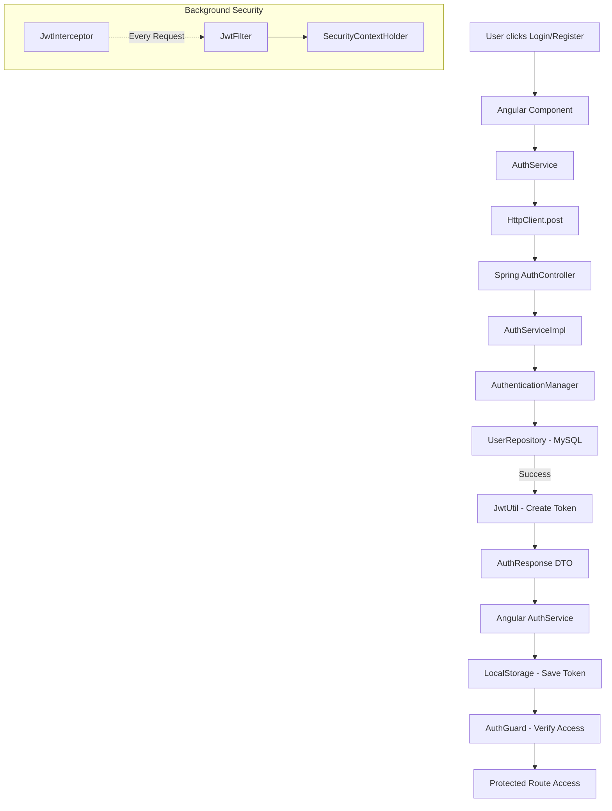

# MODULE 1: Authentication & JWT (Master Walkthrough)

## 🏗️ 1️⃣ Introduction to Authentication
- **What is it?**: The process of identifying a user. In MediaConnect, we verify your email and password.
- **Why JWT?**: Unlike traditional session-based auth where the server remembers you in its RAM, **JWT (JSON Web Token)** is a "State-less" mechanism. The user carries their own identity in an encrypted string.
- **Analogy**: It's like a **Passport**. The government (Backend) gives you a stamped document. You carry it. Any country (Endpoint) you visit just looks at the stamp to see if it's valid.

---

## 🗺️ 1.5 COMMUNICATION FLOWCHART
This flowchart illustrates how the Frontend and Backend interact during the Authentication process.



---

## 🔗 2️⃣ THE COMPLETE COMMUNICATION CHAIN (Step-by-Step)

1.  **FRONTEND UI**: User enters email/password in `login.component.html`.
2.  **COMPONENT**: `login.component.ts` picks the values and calls the service.
3.  **SERVICE**: `auth.service.ts` sends an `HttpClient.post` to the backend.
4.  **INTERCEPTOR**: `jwt.interceptor.ts` is ready to attach tokens to *future* requests.
5.  **API CALL**: Data travels over HTTP to `http://localhost:8081/api/auth/login`.
6.  **CONTROLLER**: `AuthController.java` receives the JSON and passes it to the service logic.
7.  **BACKEND SERVICE**: `AuthServiceImpl.java` calls the `AuthenticationManager`.
8.  **REPOSITORY**: `UserRepository.java` checks if the email exists in MySQL.
9.  **DATABASE**: MySQL returns the user record (including the hashed password).
10. **JWT CREATION**: If password matches, `JwtUtil.java` creates a long encrypted string (Token).
11. **RESPONSE DTO**: `AuthResponse.java` object is created with the token and user details.
12. **FRONTEND STORAGE**: `auth.service.ts` receives the token and saves it in `localStorage`.
13. **GUARD VALIDATION**: `auth.guard.ts` checks for this token before letting user see `/home`.
14. **PROTECTED ROUTE**: User is allowed to enter and see movies.

---

## 📄 3️⃣ BACKEND: Detailed Code-Level Walkthrough


### 1. `AuthController.java`
**Location**: `Backend/src/main/java/com/mediaconnect/backend/controller/`

```java
package com.mediaconnect.backend.controller;

import com.mediaconnect.backend.dto.request.AuthRequest;
import com.mediaconnect.backend.dto.response.AuthResponse;
import com.mediaconnect.backend.service.AuthService;
import org.springframework.beans.factory.annotation.Autowired;
import org.springframework.http.ResponseEntity;
import org.springframework.web.bind.annotation.*;

@RestController
@RequestMapping("/api/auth")
public class AuthController {

    @Autowired
    private AuthService authService;

    @PostMapping("/register")
    public ResponseEntity<AuthResponse> register(@RequestBody AuthRequest request) {
        AuthResponse response = authService.register(request);
        return ResponseEntity.ok(response);
    }

    @PostMapping("/login")
    public ResponseEntity<AuthResponse> login(@RequestBody AuthRequest request) {
        AuthResponse response = authService.login(request);
        return ResponseEntity.ok(response);
    }
}
```
**📜 Logic/Info:**
- **`@RestController`**: Combines `@Controller` and `@ResponseBody`. It tells Spring that the return value of methods should be bound to the web response body (JSON).
- **`@RequestMapping("/api/auth")`**: This is the "Base Path". Any request starting with this URL will be routed to this class.
- **`@PostMapping`**: Specifically handles HTTP POST requests. Registration and Login send data to the server, so POST is used.
- **`@RequestBody`**: This is a magician. It takes the JSON coming from Angular and automatically converts it into a Java `AuthRequest` object.
- **`ResponseEntity`**: A wrapper that allows us to send not just the data, but also the HTTP Status Code (like 200 OK or 201 Created).

---

### 2. `AuthService.java` (Interface)
**Location**: `Backend/src/main/java/com/mediaconnect/backend/service/`

```java
package com.mediaconnect.backend.service;

import com.mediaconnect.backend.dto.request.AuthRequest;
import com.mediaconnect.backend.dto.response.AuthResponse;

public interface AuthService {
    AuthResponse register(AuthRequest request);
    AuthResponse login(AuthRequest request);
}
```
**📜 Logic/Info:**
- **Interface**: Think of this as a **Menu** in a restaurant. It lists what dishes (methods) are available, but it doesn't show you how the chef cooks them.
- **Benefit**: It allows the application to be flexible. If we want to change the authentication logic later (e.g., from JWT to something else), we just create a new implementation of this interface.

---

### 3. `AuthServiceImpl.java` (Implementation)
**Location**: `Backend/src/main/java/com/mediaconnect/backend/service/implementations/`

```java
@Service
public class AuthServiceImpl implements AuthService {

    @Autowired
    private UserRepository userRepository;

    @Autowired
    private PasswordEncoder passwordEncoder;

    @Autowired
    private JwtUtil jwtUtil;

    @Autowired
    private AuthenticationManager authenticationManager;

    @Override
    public AuthResponse register(AuthRequest request) {
        // Check if email already exists
        if (userRepository.existsByEmail(request.getEmail())) {
            throw new RuntimeException("Email already exists!");
        }

        User user = new User();
        user.setFullName(request.getFullName());
        user.setEmail(request.getEmail());
        // ENCRYPT THE PASSWORD! Never save plain text.
        user.setPassword(passwordEncoder.encode(request.getPassword()));
        user.setRole("USER"); // Default role
        user.setSubscriptionStatus("INACTIVE");

        // Convert list of genres to a comma-separated string
        if (request.getGenrePreferences() != null) {
            user.setGenres(String.join(",", request.getGenrePreferences()));
        }

        User savedUser = userRepository.save(user);
        return new AuthResponse(null, savedUser.getRole(), savedUser.getId(), mapToDTO(savedUser));
    }

    @Override
    public AuthResponse login(AuthRequest request) {
        // This line triggers the Spring Security validation chain
        authenticationManager.authenticate(
                new UsernamePasswordAuthenticationToken(request.getEmail(), request.getPassword())
        );

        User user = userRepository.findByEmail(request.getEmail());
        // Generate the token for the verified user
        String token = jwtUtil.generateToken(user.getEmail());

        return new AuthResponse(token, user.getRole(), user.getId(), mapToDTO(user));
    }

    private UserDTO mapToDTO(User user) {
        return new UserDTO(user.getId(), user.getFullName(), user.getEmail(), 
                          user.getGenres(), user.getRole(), user.getSubscriptionStatus(),
                          user.getCurrentPlan(), user.getSubscriptionExpiry() != null ? user.getSubscriptionExpiry().toString() : null);
    }
}
```
**📜 Logic/Info:**
- **`@Service`**: Tells Spring that this class holds the business logic of our application.
- **`passwordEncoder.encode()`**: This uses BCrypt to turn a password like "secret123" into a 60-character scrambled string. It's impossible to reverse!
- **`authenticationManager.authenticate()`**: This is the heart of the login. It automatically checks the database, compares the hashed password, and throws an error if anything is wrong.
- **`mapToDTO`**: We never send the `User` object (which contains the password hash) to the frontend. Instead, we copy only the safe fields into a `UserDTO`.


---


### 4. `UserRepository.java`
**Location**: `Backend/src/main/java/com/mediaconnect/backend/repository/`

```java
package com.mediaconnect.backend.repository;

import com.mediaconnect.backend.entity.User;
import org.springframework.data.jpa.repository.JpaRepository;

public interface UserRepository extends JpaRepository<User, Long> {
    
    // Find a user by their unique email
    User findByEmail(String email);
    
    // Check if a user with this email already exists
    boolean existsByEmail(String email);
}
```
**📜 Logic/Info:**
- **`JpaRepository<User, Long>`**: By extending this, Spring gives us all SQL commands (`INSERT`, `UPDATE`, `DELETE`, `SELECT`) for free! We don't have to write any SQL ourselves.
- **`findByEmail`**: This is a **Query Method**. Spring is smart enough to see the name "findByEmail" and automatically write the SQL `SELECT * FROM users WHERE email = ?`.
- **`existsByEmail`**: Similarly, it writes `SELECT COUNT(*) FROM users WHERE email = ?` and returns `true` or `false`.

---

### 5. `User.java` (The Entity)
**Location**: `Backend/src/main/java/com/mediaconnect/backend/entity/`

```java
@Entity
@Table(name = "users")
public class User {
    @Id
    @GeneratedValue(strategy = GenerationType.IDENTITY)
    private Long id;

    private String fullName;

    @Column(unique = true, nullable = false)
    private String email;

    @Column(nullable = false)
    private String password;

    private String role; // Stores "ADMIN" or "USER"

    private String genres; // Stores preferences like "Action,Comedy"

    private String subscriptionStatus; // "ACTIVE" or "INACTIVE"
    
    // Getters and Setters...
}
```
**📜 Logic/Info:**
- **`@Entity`**: Marks this as a database table.
- **`@Table(name = "users")`**: Tells the database to name the table "users".
- **`@Id` & `@GeneratedValue`**: Automatically creates a unique number (ID) for every new user.
- **`@Column(unique = true)`**: Ensures two users can never have the same email address in our database.

---

### 6. `AuthRequest.java` (The Input DTO)
**Location**: `Backend/src/main/java/com/mediaconnect/backend/dto/request/`

```java
public class AuthRequest {
    private String email;
    private String password;
    private String fullName;
    private List<String> genrePreferences;
    
    // Getters and Setters...
}
```
**📜 Logic/Info:**
- **DTO**: "Data Transfer Object". It’s like a specialized **Container** used to carry data from the browser to our API.
- **Why?**: It only contains the fields we need for login/register, keeping our logic clean.

---

### 7. `AuthResponse.java` (The Output DTO)
**Location**: `Backend/src/main/java/com/mediaconnect/backend/dto/response/`

```java
public class AuthResponse {
    private String token; // The JWT string
    private String role;  // User role
    private Long userId;  // ID
    private UserDTO user; // Full user details
    
    // Constructor...
}
```
**📜 Logic/Info:**
- **The Token**: After login, we put the lucky JWT string here to send it to the user.
- **Why return Role?**: So the frontend knows immediately if it should show the "Admin Dashboard" or just the "Movie Catalog".


---


### 8. `JwtUtil.java` (The Token Specialist)
**Location**: `Backend/src/main/java/com/mediaconnect/backend/security/`

```java
@Component
public class JwtUtil {
    // A long secret key known only to our backend
    private String SECRET = "5367566B59703373367639792F423F4528482B4D6251655468576D5A71347437";

    public String generateToken(String email) {
        return Jwts.builder()
                .setSubject(email)
                .setIssuedAt(new Date(System.currentTimeMillis()))
                .setExpiration(new Date(System.currentTimeMillis() + 1000 * 60 * 60 * 10)) // Valid for 10 hours
                .signWith(SignatureAlgorithm.HS256, SECRET)
                .compact();
    }

    public String extractUsername(String token) {
        return Jwts.parser().setSigningKey(SECRET).parseClaimsJws(token).getBody().getSubject();
    }
}
```
**📜 Logic/Info:**
- **`@Component`**: Tells Spring "Create an object of this class and keep it in your pocket, I'll need it later."
- **`setSubject`**: We put the user's `email` inside the token so we know who they are.
- **`compact()`**: This generates the final "Bearer string" (e.g., `eyJhbGciOi...`).
- **`parseClaimsJws`**: This is how we "Read" an incoming token.

---

### 9. `JwtFilter.java` (The Request Interceptor)
**Location**: `Backend/src/main/java/com/mediaconnect/backend/security/`

```java
@Component
public class JwtFilter extends OncePerRequestFilter {
    @Autowired
    private JwtUtil jwtUtil;

    @Override
    protected void doFilterInternal(HttpServletRequest request, HttpServletResponse response, FilterChain chain) {
        String header = request.getHeader("Authorization");

        if (header != null && header.startsWith("Bearer ")) {
            String token = header.substring(7);
            String email = jwtUtil.extractUsername(token);

            if (email != null && SecurityContextHolder.getContext().getAuthentication() == null) {
                // ... logic to set the user as "Logged In" in Spring's memory
            }
        }
        chain.doFilter(request, response);
    }
}
```
**📜 Logic/Info:**
- **The Filter**: This is a "Middleman". Every request coming to our server must first pass through this filter.
- **`substring(7)`**: "Bearer " is 7 characters. We cut it off to get just the actual token characters.
- **`SecurityContextHolder`**: This is Spring's temporary memory. If we put a user here, Spring knows the user is logged in for this specific request.

---

### 10. `SecurityConfig.java` (The Master Rules)
**Location**: `Backend/src/main/java/com/mediaconnect/backend/security/`

```java
@Configuration
@EnableWebSecurity
public class SecurityConfig {

    @Bean
    public SecurityFilterChain filterChain(HttpSecurity http) throws Exception {
        return http
            .csrf(csrf -> csrf.disable()) // Disable CSRF
            .authorizeHttpRequests(auth -> auth
                .requestMatchers("/api/auth/**").permitAll() // Open login/register
                .anyRequest().authenticated()               // Lock everything else
            )
            .sessionManagement(s -> s.sessionCreationPolicy(SessionCreationPolicy.STATELESS))
            .addFilterBefore(jwtFilter, UsernamePasswordAuthenticationFilter.class)
            .build();
    }
}
```
**📜 Logic/Info:**
- **`csrf().disable()`**: CSRF is for websites using cookies. We use tokens, so we don't need this protection.
- **`permitAll()`**: This is the most important "Unlock" command. Without it, you couldn't even reach the login page!
- **`STATELESS`**: It tells Spring "Don't store any user sessions in your internal RAM. Let the user carry their own JWT identity."


---


### 11. `CustomUserDetailsService.java`
**Location**: `Backend/src/main/java/com/mediaconnect/backend/security/`

```java
@Service
public class CustomUserDetailsService implements UserDetailsService {
    @Autowired
    private UserRepository userRepository;

    @Override
    public UserDetails loadUserByUsername(String email) {
        User user = userRepository.findByEmail(email);
        return new org.springframework.security.core.userdetails.User(
            user.getEmail(), user.getPassword(), new ArrayList<>()
        );
    }
}
```
**📜 Logic/Info:**
- **Bridging Logic**: Tells Spring Security how to find users in OUR database using the `UserRepository`.

---

### 12. `DataInitializer.java`
**Location**: `Backend/src/main/java/com/mediaconnect/backend/config/`


```java
@Component
public class DataInitializer implements CommandLineRunner {
    @Override
    public void run(String... args) {
        if (!userRepository.existsByEmail("admin@mediaconnect.com")) {
            User admin = new User();
            admin.setEmail("admin@mediaconnect.com");
            admin.setPassword(passwordEncoder.encode("admin123"));
            admin.setRole("ADMIN");
            userRepository.save(admin);
        }
    }
}
```
**📜 Logic/Info:**
- **Bootstrapping**: Automatically runs when the app starts. Ensures we have a default "ADMIN" account to test with.

---

## 📄 4️⃣ FRONTEND: Detailed Code Walkthrough


### 1. `login.component.ts`
**Location**: `Frontend/src/app/components/login/`

```typescript
import { Component, inject } from '@angular/core';
import { FormBuilder, Validators, ReactiveFormsModule } from '@angular/forms';
import { AuthService } from '../../services/auth.service';
import { Router, RouterLink } from '@angular/router';

@Component({
  selector: 'app-login',
  standalone: true,
  imports: [ReactiveFormsModule, RouterLink],
  templateUrl: './login.component.html'
})
export class LoginComponent {
  private fb = inject(FormBuilder);
  private authService = inject(AuthService);
  private router = inject(Router);

  loginForm = this.fb.group({
    email: ['', [Validators.required, Validators.email]],
    password: ['', [Validators.required]]
  });

  onSubmit() {
    if (this.loginForm.valid) {
      this.authService.login(this.loginForm.value as any).subscribe({
        next: () => this.router.navigate(['/home']),
        error: (err) => alert('Login failed: ' + err.error)
      });
    }
  }
}
```
**📜 Logic/Info:**
- **`FormBuilder`**: A helper class that makes it easy to create complex forms with validation rules.
- **`Validators.email`**: Ensures the user types a real email address (e.g., must have an `@` and a `.`).
- **`inject()`**: A modern Angular way (v16+) to perform Dependency Injection without using a constructor.
- **`subscribe()`**: Since searching the internet takes time, `login` returns an **Observable**. We "subscribe" to it and wait for the server's reply.

---

### 2. `login.component.html`
**Location**: `Frontend/src/app/components/login/`

```html
<form [formGroup]="loginForm" (ngSubmit)="onSubmit()">
  <h1>Sign In</h1>
  <input type="email" formControlName="email" placeholder="Email">
  <input type="password" formControlName="password" placeholder="Password">
  <button type="submit" [disabled]="loginForm.invalid">Login</button>
  <p>New user? <a routerLink="/register">Register here</a></p>
</form>
```
**📜 Logic/Info:**
- **`[formGroup]`**: Connects the HTML form to the `loginForm` variable in our TypeScript code.
- **`formControlName`**: Links a specific input field to a specific control (like "email" or "password").
- **`(ngSubmit)`**: Tells Angular "When the user clicks the button, run the `onSubmit()` function".
- **`[disabled]`**: Automatically grays out the button if the user hasn't filled in the form correctly.

---


---

### 3. `register.component.ts`
**Location**: `Frontend/src/app/components/register/`

```typescript
import { Component, inject } from '@angular/core';
import { FormBuilder, Validators, ReactiveFormsModule } from '@angular/forms';
import { AuthService } from '../../services/auth.service';
import { Router, RouterLink } from '@angular/router';

@Component({
  selector: 'app-register',
  standalone: true,
  imports: [ReactiveFormsModule, RouterLink],
  templateUrl: './register.component.html'
})
export class RegisterComponent {
  private fb = inject(FormBuilder);
  private authService = inject(AuthService);
  private router = inject(Router);

  registerForm = this.fb.group({
    fullName: ['', [Validators.required]],
    email: ['', [Validators.required, Validators.email]],
    password: ['', [Validators.required, Validators.minLength(6)]],
    genrePreferences: [[]]
  });

  onSubmit() {
    if (this.registerForm.valid) {
      this.authService.register(this.registerForm.value as any).subscribe({
        next: () => this.router.navigate(['/login']),
        error: (err) => alert('Registration failed')
      });
    }
  }
}
```
**📜 Logic/Info:**
- **`minLength(6)`**: Ensures the user chooses a secure password.
- **`genrePreferences`**: Captures user interests during sign-up.

---

### 4. `register.component.html`
**Location**: `Frontend/src/app/components/register/`

```html
<form [formGroup]="registerForm" (ngSubmit)="onSubmit()">
  <h1>Sign Up</h1>
  <input type="text" formControlName="fullName" placeholder="Full Name">
  <input type="email" formControlName="email" placeholder="Email">
  <input type="password" formControlName="password" placeholder="Password">
  <button type="submit" [disabled]="registerForm.invalid">Register</button>
  <p>Already have an account? <a routerLink="/login">Login</a></p>
</form>
```

---

### 5. `auth.service.ts`
**Location**: `Frontend/src/app/services/`


```typescript
@Injectable({ providedIn: 'root' })
export class AuthService {
  private apiUrl = 'http://localhost:8081/api/auth';
  private currentUserSubject = new BehaviorSubject<AuthResponse | null>(null);

  constructor(private http: HttpClient) {
    const savedUser = localStorage.getItem('currentUser');
    if (savedUser) this.currentUserSubject.next(JSON.parse(savedUser));
  }

  login(credentials: any): Observable<AuthResponse> {
    return this.http.post<AuthResponse>(`${this.apiUrl}/login`, credentials).pipe(
      tap(res => {
        localStorage.setItem('token', res.token);
        localStorage.setItem('currentUser', JSON.stringify(res));
        this.currentUserSubject.next(res);
      })
    );
  }

  logout() {
    localStorage.removeItem('token');
    localStorage.removeItem('currentUser');
    this.currentUserSubject.next(null);
  }

  getToken() { return localStorage.getItem('token'); }
  isAuthenticated() { return !!this.getToken(); }
}
```
**📜 Logic/Info:**
- **`BehaviorSubject`**: This is like a **Live News Feed**. Whenever a user logs in or out, it "broadcasts" the news to every component in the app.
- **`localStorage`**: The "Persistent Memory" of the browser. We save the token here so the user doesn't have to log in again if they refresh the page.
- **`.pipe(tap(...))`**: This allows us to perform a "side-effect" (like saving the token) immediately after the server replies, before the component even knows.
- **`JSON.stringify`**: We can only store strings in `localStorage`, so we convert our user object into a string.


### 6. `jwt.interceptor.ts`
**Location**: `Frontend/src/app/interceptors/`

```typescript
import { HttpInterceptorFn } from '@angular/common/http';
import { inject } from '@angular/core';
import { AuthService } from '../services/auth.service';

export const jwtInterceptor: HttpInterceptorFn = (req, next) => {
  const authService = inject(AuthService);
  const token = authService.getToken();

  if (token) {
    req = req.clone({
      setHeaders: {
        Authorization: `Bearer ${token}`
      }
    });
  }

  return next(req);
};
```
**📜 Logic/Info:**
- **Cloning**: We must clone the original request to add headers safely.
- **Bearer**: The industry-standard prefix for JWT tokens.

---


### 7. `auth.guard.ts` (The Bouncer)
**Location**: `Frontend/src/app/guards/`

```typescript
export const authGuard: CanActivateFn = (route, state) => {
  const authService = inject(AuthService);
  const router = inject(Router);

  if (authService.isAuthenticated()) {
    return true; // Token found, let them in!
  } else {
    router.navigate(['/login']); // No token, kick to login!
    return false;
  }
};
```
**📜 Logic/Info:**
- **`CanActivateFn`**: This is a guardrail for your URL routes.
- **`isAuthenticated()`**: It simply checks "Does the browser have a JWT token?". If no, it blocks access to pages like `/home` or `/profile`.

---

### 8. `auth-response.model.ts`
**Location**: `Frontend/src/app/models/`

```typescript
export interface AuthResponse {
  token: string;
  role: string;
  userId: number;
  user: User;
}
```
**📜 Logic/Info:**
- **Interface**: It’s a **Blueprint**. It tells Angular exactly what the JSON coming from the backend will look like.
- **Type Safety**: It prevents bugs by ensuring we don't try to read a field that doesn't exist (like `user.age` if it's not there).


---

## 🔍 5️⃣ DEEP DIVE: JWT & INTERCEPTORS (THE INNER WORKINGS)

### 🏭 1. JWT Creation (The Backend Factory)
The creation takes place in **`JwtUtil.java`** using a library called `jjwt`. 

**The Code:**
```java
private String createToken(Map<String, Object> claims, String subject) {
    return Jwts.builder()
            .setClaims(claims)
            .setSubject(subject) // The User's Email
            .setIssuedAt(new Date(System.currentTimeMillis()))
            .setExpiration(new Date(System.currentTimeMillis() + 1000 * 60 * 60 * 10))
            .signWith(SECRET_KEY) // SIGNING happens here
            .compact();
}
```
**Logic Breakdown:**
- **Subject**: We put the user's `email` here. It's the unique ID of the token.
- **SignWith**: This is the most important part. It uses the `SECRET_KEY` and an algorithm (HS256). 
- **Wait, is it Encryption?**: No! It is **DIGITAL SIGNING**. Anyone can decode the token and read the email, but no one can change it because they don't have the `SECRET_KEY` to resign it.

### 📮 2. The Frontend Postman (Angular Interceptor)
Every time Angular wants to talk to the Backend (e.g., "Give me movies"), it needs to show the token. 

**The Code (`jwt.interceptor.ts`):**
```typescript
export const jwtInterceptor: HttpInterceptorFn = (req, next) => {
  const authService = inject(AuthService);
  const token = authService.getToken(); // 1. Get token from service

  if (token) {
    req = req.clone({ // 2. Clone the request
      setHeaders: {
        Authorization: `Bearer ${token}` // 3. Add the header
      }
    });
  }
  return next(req); // 4. Let it go to the backend
};
```
**Logic Breakdown:**
- **Cloning**: In Angular, HTTP requests are "immutable" (cannot be modified directly). To add a header, we must create a **Clone** (a copy) and add the header to that copy.

---

## 📚 6️⃣ TOPIC-WISE DEEP DIVE (BEGINNER TO INTERVIEW READY)


### 🅰️ ANGULAR TOPICS (FRONTEND)

#### 1. Reactive Forms
- **Beginner Definition**: A "Master Control Room" for your forms. Instead of letting the HTML handle the logic, you manage every single field and its rules directly in your TypeScript code.
- **Technical Detail**: It uses `FormGroup` to group fields and `FormControl` for individual inputs. It provides a synchronous data model.
- **Interview Q**: Difference between Template-driven and Reactive? 
  - **A**: Reactive is more scalable, predictable (logic is in TS), and easier to unit test.
- **Subtopics**: `Validators` (Checks if input is valid), `FormArray` (Dynamic lists of inputs).

#### 2. Dependency Injection (DI)
- **Beginner Definition**: Like a **Home Delivery Service**. If you need a "Tool" (Service), you don't build it yourself; you just ask the system to "deliver" it to your constructor.
- **Technical Detail**: A design pattern where a class receives its dependencies from an external injector rather than creating them.
- **Interview Q**: What is a Singleton Service?
  - **A**: Using `providedIn: 'root'`, Angular creates only ONE instance of the service for the entire app.

#### 3. HttpClient
- **Beginner Definition**: The **Telephone** of your app. It’s used to call the Backend server and ask for data.
- **Technical Detail**: Built on top of `XMLHttpRequest`, it returns **Observables** and handles JSON parsing automatically.
- **Interview Q**: Why use HttpClient over Fetch API?
  - **A**: It has built-in support for Interceptors, better error handling, and works seamlessly with RxJS.

#### 4. HttpInterceptors
- **Beginner Definition**: A **Security Checkpoint** at the airport. Every message (Request) leaving your app must pass through this checkpoint to get a "Stamp" (JWT Token).
- **Technical Detail**: A functional or class-based service that intercepts and transforms HTTP requests/responses.
- **Interview Q**: How do you add a token to only specific requests?
  - **A**: Use `if (req.url.includes('/api/auth'))` logic inside the interceptor to skip or include headers.

#### 5. Route Guards (CanActivate)
- **Beginner Definition**: The **Bouncer** at a club. It checks your ID (Token) and decides if you are allowed to enter a specific room (Route).
- **Technical Detail**: A service that implements `CanActivate` to return `true` or `false` based on logic (like `authService.isAuthenticated()`).
- **Interview Q**: Can a user bypass a Guard?
  - **A**: Locally in the browser, yes (by hacking JS), but they will still be blocked by the **Backend Security** because they won't have a valid JWT.

#### 6. LocalStorage
- **Beginner Definition**: A **Small Locker** inside your browser where you can save notes (Tokens) even if you refresh the page or close the tab.
- **Technical Detail**: A key-value storage that persists data across sessions until manually cleared.
- **Interview Q**: What is the size limit of LocalStorage?
  - **A**: Usually around 5MB - 10MB per domain.

#### 7. RxJS - BehaviorSubject
- **Beginner Definition**: A **Continuous News Feed**. It always holds the "Latest News" (Current User State), and anyone who joins late (Subscribes) immediately gets the current update.
- **Technical Detail**: A special variety of `Subject` that requires an initial value and emits the current value to new subscribers.
- **Interview Q**: Difference between Subject and BehaviorSubject?
  - **A**: Subject has no initial value and doesn't remember history. BehaviorSubject holds the current value.

#### 8. RxJS - Tap Operator
- **Beginner Definition**: A **Fly-on-the-wall**. It watches the data passing by and does something "on the side" (like saving a token) without changing the data itself.
- **Technical Detail**: Used for side-effects in an observable stream.
- **Interview Q**: Does `tap` modify the data stream?
  - **A**: No, it returns an observable identical to the source.

#### 9. Standalone Components
- **Beginner Definition**: An **Independent Hero**. These components don't need a "Team" (NgModule) to work; they carry everything they need (Imports) by themselves.
- **Technical Detail**: Components that don't belong to any module, introduced to simplify Angular apps.
- **Interview Q**: Benefits of Standalone?
  - **A**: Less boilerplate code, easier lazy loading, and better tree-shaking.

#### 10. Router Component
- **Beginner Definition**: The **GPS Navigation System**. It maps the URL in your browser to the correct page on your screen.
- **Technical Detail**: The module responsible for navigation, using `Routes` arrays and `<router-outlet>`.

---

### 🍃 SPRING BOOT TOPICS (BACKEND)

#### 1. Spring Security Filter Chain
- **Beginner Definition**: A **Series of Doors** a request must pass through. Each door checks something different (Login, Roles, Tokens).
- **Technical Detail**: A stack of ordered filters that intercept requests to apply security rules.
- **Interview Q**: Is the order of filters important?
  - **A**: Yes! We must add `JwtFilter` BEFORE the `UsernamePasswordAuthenticationFilter`.

#### 2. JWT (jjwt library)
- **Beginner Definition**: A **Digital ID Card** builder. It gathers your info, puts a "Stamp" on it, and gives you a string.
- **Technical Detail**: A Java library used for generating and parsing tokens following the RFC 7519 standard.
- **Interview Q**: Can we read data inside a JWT?
  - **A**: Yes, it's just Base64 encoded. Security comes from the **Signature**, which prevents modification.

#### 3. BCrypt Hashing
- **Beginner Definition**: A **Meat Grinder**. You put a password in, it comes out as unreadable gibberish. You can't turn the gibberish back into a steak (Password).
- **Technical Detail**: A one-way adaptive hashing function that includes "Salt" (random noise) to prevent cracking.
- **Interview Q**: Why use Hashing over Encryption?
  - **A**: Encryption is two-way (can be decrypted); Hashing is one-way (more secure for passwords).

#### 4. Stateless Session Policy
- **Beginner Definition**: **Short Term Memory Loss**. The server "forgets" who you are the moment the request ends. You must show your ID (JWT) every single time.
- **Technical Detail**: `SessionCreationPolicy.STATELESS` ensures Spring doesn't create `HttpSession` objects.
- **Interview Q**: Why go Stateless?
  - **A**: Scalability! You can have 10 servers, and any server can handle the request because the token has all the info.

#### 5. Custom Filters
- **Beginner Definition**: A **Custom Gate**. You built it to check the "Digital ID Card" (JWT) before letting anyone into the palace.
- **Technical Detail**: Classes extending `OncePerRequestFilter` to perform logic once per servlet request.

#### 6. UserDetailsService
- **Beginner Definition**: The **Librarian**. When someone claims to be "Admin", Spring asks this librarian to go to the Database and find the real details of that user.
- **Technical Detail**: Interface used to load user-specific data during authentication.

#### 7. Data Transfer Objects (DTOs)
- **Beginner Definition**: A **Custom Envelope**. You don't send the whole database table (Entity) over the mail; you only put the specific fields (Email, Role) in this envelope.
- **Technical Detail**: Objects used to pass data between layers without exposing hidden DB internal fields.

#### 8. Spring Data JPA
- **Beginner Definition**: **English-to-SQL Translator**. You write `findByEmail()`, and it automatically writes the complex SQL code for you.
- **Technical Detail**: Part of the Spring Data project that handles DB persistence via the Java Persistence API.

#### 9. CommandLineRunner
- **Beginner Definition**: An **Alarm Clock**. It rings (runs code) as soon as the application wakes up (starts).
- **Technical Detail**: An interface used to run a block of code immediately after the application context is loaded.

#### 10. CORS (Cross-Origin Resource Sharing)
- **Beginner Definition**: The **Language Fence**. Port 4200 (Angular) and Port 8081 (Spring) are like two different countries. CORS is the permission for them to talk to each other.


---

## ❓ 7️⃣ INTERVIEW QUESTIONS (50+)

### 🌐 Section 1: JWT & Security

### 🌐 Section 1: JWT & Security (15 Questions)
1. **What is JWT?** 
   - *Simple*: A digital wristband that proves you are logged in.
   - *Technical*: JSON Web Token is a compact, URL-safe means of representing claims between two parties.
2. **3 Parts of JWT?** 
   - Header (Algorithm), Payload (Data/Claims), Signature (Security check).
3. **Difference between Login and Registration?** 
   - Registration creates the user; Login verifies the user and gives a token.
4. **What is a Secret Key?** 
   - A string used by the backend to sign and verify tokens.
5. **How do you log out in a JWT system?** 
   - Delete the token from `localStorage` in the frontend.
6. **Where are passwords saved?** 
   - In the database, hashed using BCrypt. Never plain text.
7. **Role of JwtFilter?** 
   - It intercepts every request to see if a valid token is present in the header.
8. **Why use DTOs?** 
   - To avoid exposing sensitive database fields (like passwords) to the frontend.
9. **What is 401 Unauthorized?** 
   - The user is not identifying themselves (invalid or no token).
10. **What is 403 Forbidden?** 
    - The user is logged in but doesn't have permission (e.g., User trying to see Admin page).
11. **Explain the 'Bearer' scheme.** 
    - A standard prefix used in HTTP headers to indicate the token type.
12. **Is JWT Encrypted?** 
    - No, it is usually just Signed. Base64 is readable, so don't put passwords inside the token!
13. **What is a 'Claim' in JWT?** 
    - A piece of information inside the payload, like `sub` (subject) or `roles`.
14. **How long should a JWT last?** 
    - Depends on the app. Ours lasts 10 hours.
15. **What is Base64?** 
    - An encoding system to turn binary data into safe text characters for URLs.

### ☕ Section 2: Backend & Spring Security (20 Questions)
16. **What is `@EnableWebSecurity`?** 
    - An annotation to enable Spring Security's web security support.
17. **Explain the Filter Chain.** 
    - A series of filters that every HTTP request goes through for security checks.
18. **Why is `SessionCreationPolicy.STATELESS` important?** 
    - It tells Spring NOT to create sessions, making the system scalable.
19. **What is `AuthenticationManager`?** 
    - The main entry point for the authentication process in Spring Security.
20. **Role of `UserDetailsService`?** 
    - It loads user-specific data (from DB) so Spring can authenticate them.
21. **What is `SecurityContextHolder`?** 
    - A place where Spring stores details of the currently authenticated user.
22. **What is a `Principal`?** 
    - The currently logged-in user's identity.
23. **How does BCrypt prevent hacking?** 
    - It uses "Salting" (adding random noise) and is slow by design.
24. **What is `@RestController`?** 
    - Combines `@Controller` and `@ResponseBody` to return JSON directly.
25. **What is `@RequestBody`?** 
    - Maps the incoming JSON request body to a Java object.
26. **What is `@Autowired`?** 
    - Tells Spring to automatically inject a dependency (like a service).
27. **Difference between `JpaRepository` and `CrudRepository`?** 
    - `JpaRepository` provides extra methods for paging, sorting, and flushing.
28. **What is `CommandLineRunner`?** 
    - An interface used to run code once as soon as the application starts.
29. **Why disable CSRF for APIs?** 
    - Because APIs don't use cookies, which are needed for CSRF attacks.
30. **What is `@Component`?** 
    - A generic annotation for any Spring-managed component.
31. **What is `@Configuration`?** 
    - Marks a class as a source of bean definitions for the application context.
32. **Explain `@Bean`.** 
    - Used on a method to register the returned object as a Spring Bean.
33. **What is `UsernamePasswordAuthenticationToken`?** 
    - A simple implementation of the `Authentication` interface.
34. **Role of `OncePerRequestFilter`?** 
    - Ensures the filter is executed only once per request.
35. **How to handle CORS issues?** 
    - Using `@CrossOrigin` or `WebMvcConfigurer` to allow different ports.

### 🅰️ Section 3: Frontend & Angular (15 Questions)
36. **What is an Angular Interceptor?** 
    - A service that can modify outgoing requests (like adding a token).
37. **Difference between `Observable` and `Subject`?** 
    - Observable is passive; Subject can actively emit new values.
38. **What is a `BehaviorSubject`?** 
    - A subject that remembers its last emitted value for new subscribers.
39. **Why use `localStorage`?** 
    - To keep the user logged in even if they refresh the page.
40. **What is a Route Guard?** 
    - Logic that runs before a user enters a page to check if they are allowed.
41. **Explain `ReactiveFormsModule`.** 
    - A module for building complex forms where logic is held in TypeScript.
42. **What is `formControlName`?** 
    - The link between an HTML input and a `FormControl` in TypeScript.
43. **What is `inject()` in Angular 14+?** 
    - A function to inject dependencies without using the `constructor`.
44. **What is `tap` in RxJS?** 
    - An operator used to perform a side-effect (like saving data) without changing the stream.
45. **What is `req.clone()`?** 
    - Used to copy and modify a request, since original requests are immutable.
46. **How to navigate via code?** 
    - Using the `Router.navigate()` method.
47. **What is a Standalone Component?** 
    - A component that doesn't need to be part of an `NgModule`.
48. **What is the `pipe()` function?** 
    - A way to chain multiple RxJS operators together.
49. **Explain `Validators.required`.** 
    - A built-in validator that makes a form field mandatory.
50. **How to check if user is logged in?** 
    - In our case, we check if the token exists in `localStorage`.


---

## 🚫 8️⃣ FINAL SUMMARY
- This module is the **Brain and the Shield** of MediaConnect.
- **Frontend** captures data, **Backend** verifies it, and **JWT** keeps the connection alive safely.
- You now have a complete, interview-ready guide for authentication!
